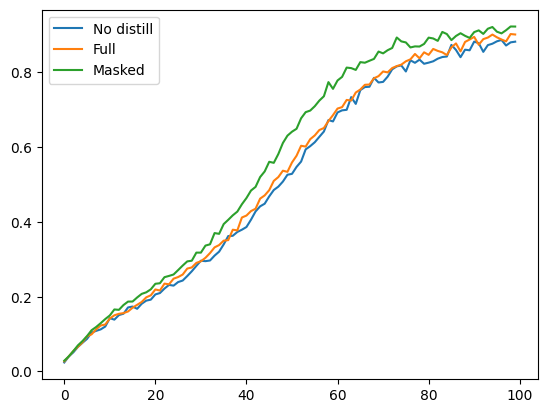

# MaskedKD implements

### Experiment
- **Dataset** : First 100 from 1000 classes of `ImageNet` valid dataset. Each class has 50 images and total 5000 images.
- **Model** : Pretrained deit `base` model as teacher and use `small` model architecture as student.
- **Hyperparameter** :
  - `mask ratio` is 0.5 which is mask proportion from MaskedKD paper.
  - `alpha` is 0.5 which is loss ratio between ce loss and kld loss.
  - `tau` is 1 which soften distillation label.
- Train 100 epochs and 32 batch size for 5,000 images and augmentation is only with random crop 224x224 image from 256x256 resized image.

### Result
`Mask patch` increase training accuracy 4.59% than `no distill` and save computational cost(time) by 29.81% than `Full patch`.
||Accuracy(%)|ComputeTime(s)|
|---|:---:|:---:|
|No distill|88.22|4668|
|Full patch|90.14|11679|
|Mask patch|92.27|8198|

### Accuracy Training

### References
[1] Son, S., Lee, N., and Lee, J., “MaskedKD: Efficient Distillation of Vision Transformers with Masked Images”, 2023.  
[2] Touvron, H., Cord, M., Douze, M., Massa, F., Sablayrolles, A., and Jégou, H., “Training data-efficient image transformers & distillation through attention”, 2020.